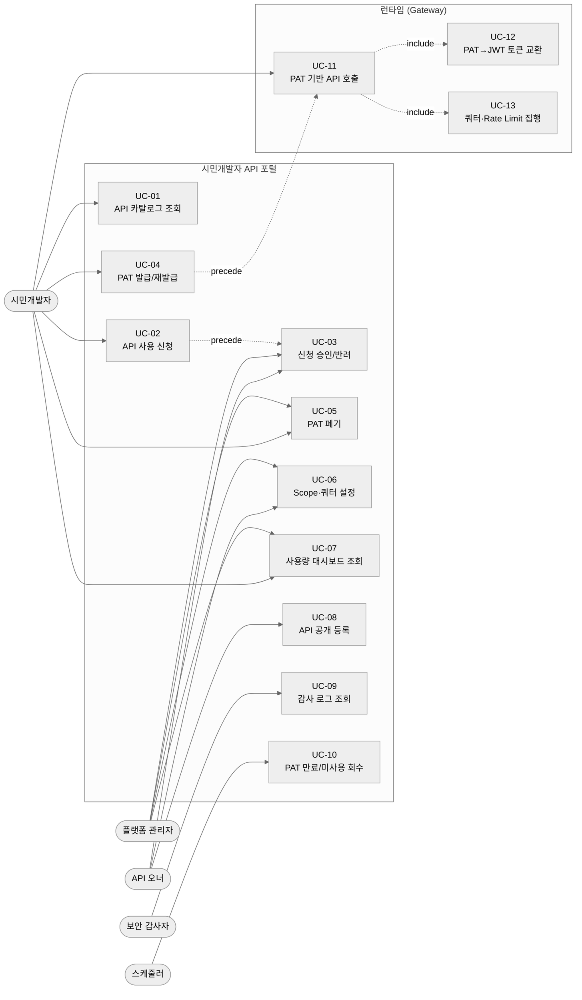
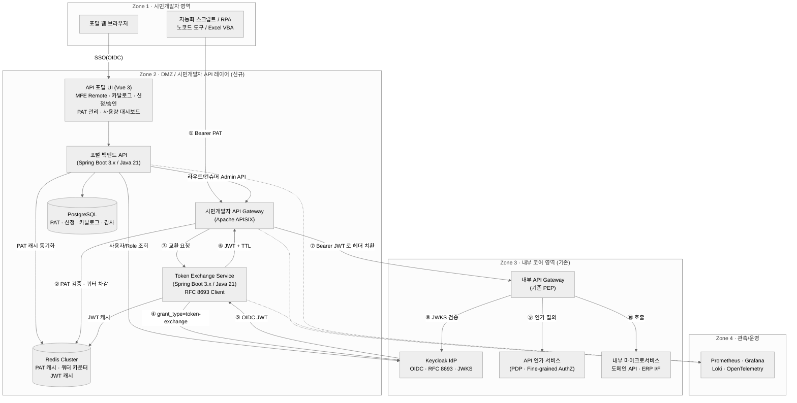
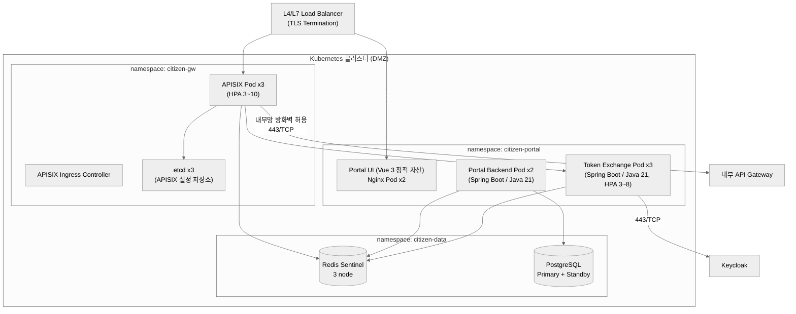
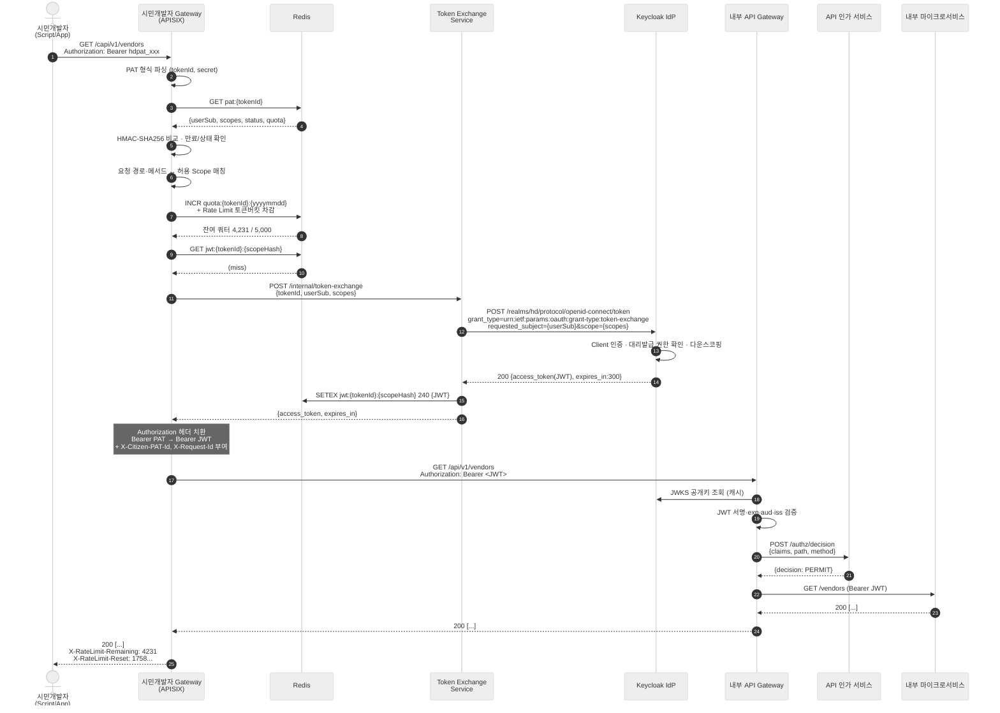
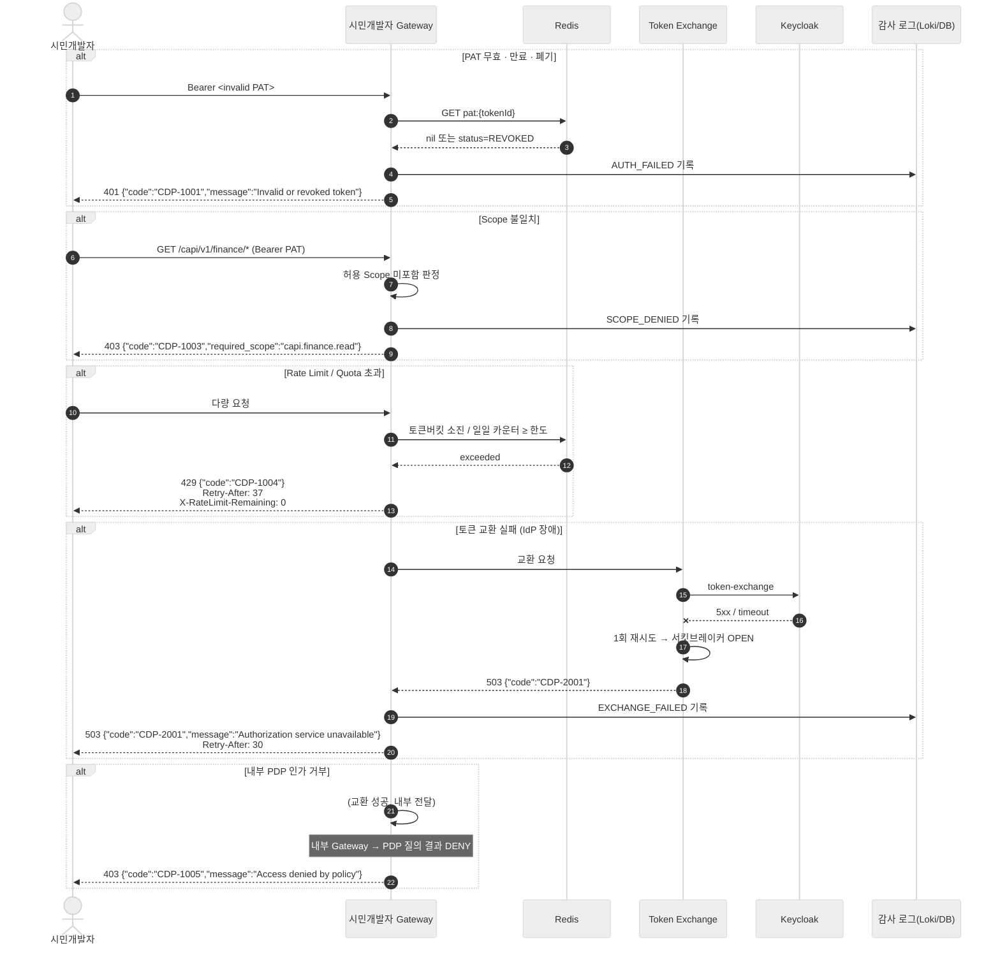
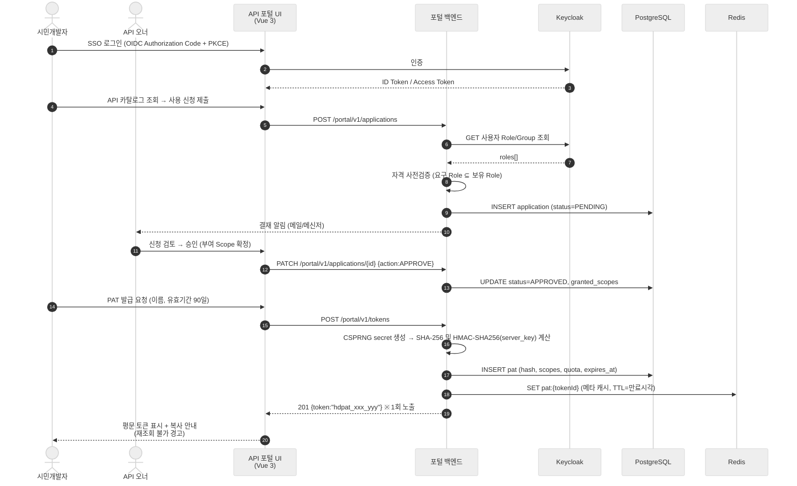
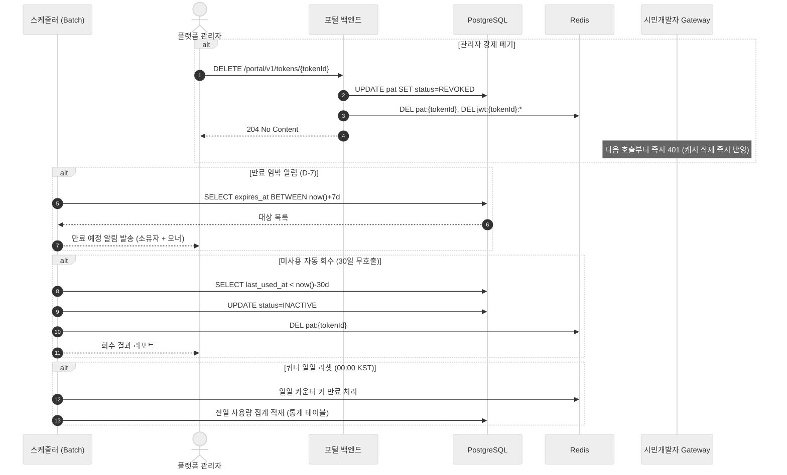
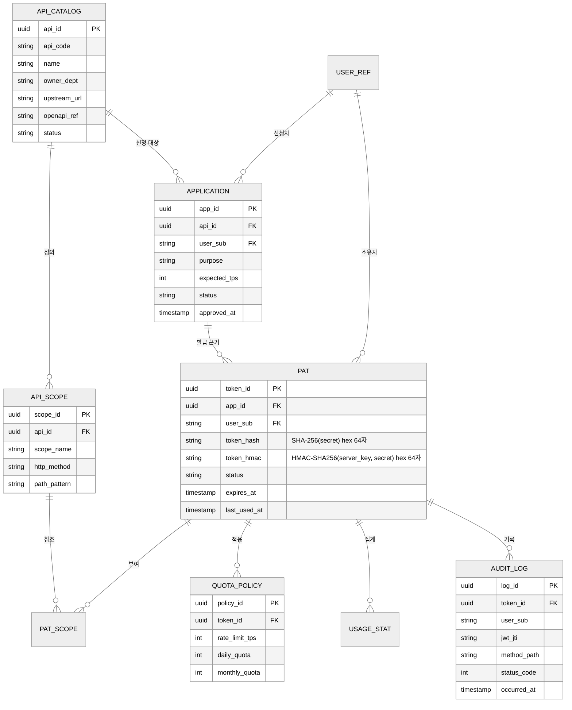
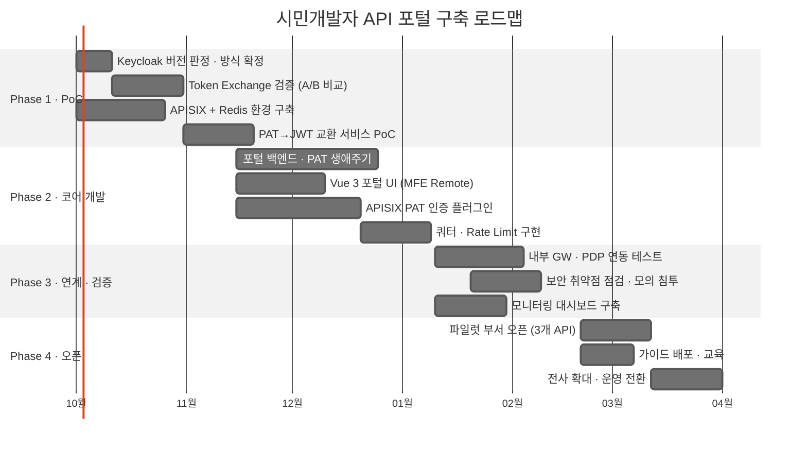

# 시민개발자 API 포털 아키텍처 정의서

**문서 ID**: SA-ARCH-CDP-001
**버전**: v1.0
**작성**: 시스템아키텍처팀 (DX)
**작성일**: 2026-09-18
**분류**: 대외비 / 내부 아키텍처 표준

---

## 1. 문서 개요

### 1.1 목적
- 현업 부서 및 시민개발자(Citizen Developer)의 업무 자동화 요구를 수용하기 위한 **시민개발자 전용 API 포털 및 Public API Gateway**의 목표 아키텍처를 정의
- 기존 BFF 토큰 핸들러 패턴 및 내부 API 인가 서비스(PDP) 체계를 **변경 없이 재활용**하는 연계 방식(PAT → OIDC JWT Token Exchange)을 확정
- 후속 상세 설계서(SA-SPEC-CDP-002)의 상위 근거 문서로 사용

### 1.2 적용 범위
| 구분 | 포함 | 제외 |
| :--- | :--- | :--- |
| 대상 시스템 | 시민개발자 API 포털, 시민개발자 API Gateway, Token Exchange Service, PAT 관리 백오피스 | 내부 업무 시스템 화면(UI) |
| 대상 사용자 | 사내 시민개발자, API 오너, 플랫폼 관리자, 보안 감사자 | 익명 외부 사용자(Anonymous) |
| 대상 API | 포털 카탈로그에 **공개 등록(Publish)** 된 내부 API | 미등록 내부 API, 관리자 전용 API |
| 연계 시스템 | Keycloak IdP, 내부 API Gateway, API 인가 서비스(PDP), MDM/ERP 도메인 API | SAP GUI 직접 접근 |

### 1.3 용어 정의
- **PAT (Personal Access Token)**: 사용자 개인 명의로 발급되는 장기 API 접근 자격 증명. 원문은 발급 시 1회만 노출.
- **Token Exchange**: RFC 8693 기반 토큰 교환. PAT를 내부에서 통용되는 OIDC JWT로 변환.
- **PDP / PEP**: Policy Decision Point(인가 판단) / Policy Enforcement Point(인가 집행).
- **Scope Bundle**: 하나의 공개 API 묶음에 매핑된 OAuth Scope 집합.
- **Quota**: 일/월 단위 누적 호출 상한. Rate Limit(TPS)과 구분.

---

## 2. 현황 및 요구사항

### 2.1 현행(As-Is) 구조 요약
- 브라우저 사용자: BFF Token Handler가 OIDC 토큰을 은닉, 클라이언트는 세션 쿠키만 보유
- 내부 API Gateway: JWT 서명 검증(JWKS) 후 API 인가 서비스(PDP)에 미세 권한 질의
- IdP: Keycloak, 표준 OIDC 및 JWKS 제공
- **한계**: 브라우저 세션이 전제되므로 스크립트·RPA·노코드 도구 등 **비대화형(Non-interactive) 호출 경로가 부재**

### 2.2 요구사항 정의
| No | 분류 | 요구사항 | 우선순위 |
| :--- | :--- | :--- | :--- |
| R-01 | 기능 | 공개 API 카탈로그 조회 및 OpenAPI 스펙 열람 | 필수 |
| R-02 | 기능 | 시민개발자 API 사용 신청 → 관리자/API 오너 승인 워크플로우 | 필수 |
| R-03 | 기능 | PAT 발급/재발급/폐기, 원문 1회 노출 | 필수 |
| R-04 | 기능 | PAT별 Scope, Rate Limit(TPS), Daily/Monthly Quota 설정 | 필수 |
| R-05 | 기능 | 사용량 통계 대시보드(호출 수, 오류율, 응답시간, 쿼터 소진율) | 필수 |
| R-06 | 연계 | PAT → OIDC JWT 교환(RFC 8693) 후 내부 Gateway 전달 | 필수 |
| R-07 | 보안 | PAT 검증값 이중 보관(원장 SHA-256 + HMAC-SHA256), 평문 미보관. Argon2id 등 memory-hard 해시는 채택하지 않음 — secret이 256bit CSPRNG이라 사전 공격 공간 자체가 존재하지 않음 (SA-SPEC-CDP-002 §3.2 참조) | 필수 |
| R-08 | 보안 | 최소 권한 원칙 — IdP 보유 권한 ∩ 공개 API Scope 범위로 제한 | 필수 |
| R-09 | 보안 | 전 호출 감사 로그(PAT ID ↔ User ID ↔ JWT jti 상관관계) | 필수 |
| R-10 | 비기능 | Gateway 추가 지연 P95 ≤ 50ms (토큰 캐시 적중 시) | 필수 |
| R-11 | 비기능 | 전 구성요소 오픈소스, 라이선스 비용 0 | 필수 |
| R-12 | 운영 | PAT 만료 사전 알림, 미사용 PAT 자동 비활성화 | 권장 |

---

## 3. 유스케이스 정의

### 3.1 액터 정의
| 액터 | 설명 | 주요 권한 |
| :--- | :--- | :--- |
| 시민개발자 (Citizen Developer) | 현업 부서의 자동화 스크립트/노코드 개발자 | 카탈로그 조회, 사용 신청, 본인 PAT 관리, 사용량 조회 |
| API 오너 (API Owner) | 도메인 API 소유 부서 담당자 | API 공개 등록, 신청 승인/반려, Scope 정의 |
| 플랫폼 관리자 (Platform Admin) | 시스템아키텍처팀 운영자 | 전체 PAT 관리, 쿼터 정책, 강제 폐기, 게이트웨이 라우트 관리 |
| 보안 감사자 (Auditor) | 정보보호 담당 | 감사 로그 열람, 권한 적정성 점검 (읽기 전용) |
| 시스템 (Scheduler) | 배치/스케줄러 | PAT 만료 점검, 쿼터 리셋, 미사용 토큰 회수 |

### 3.2 유스케이스 다이어그램

### 3.3 주요 유스케이스 명세

#### UC-02 / UC-03: API 사용 신청 및 승인
- **선행조건**: 시민개발자가 사내 SSO로 포털 로그인, 대상 API가 카탈로그에 공개 등록됨
- **기본 흐름**
  1. 시민개발자가 카탈로그에서 API 선택 → 사용 목적, 예상 호출량, 사용 기간 입력
  2. 시스템이 신청자의 IdP 권한(Role/Group)과 API 요구 권한을 대조하여 **자격 사전 검증**
  3. API 오너에게 결재 알림(메일/메신저) 발송
  4. API 오너가 승인 → 신청 상태 `APPROVED`, 부여 가능 Scope 확정
- **대안 흐름**: 자격 미충족 시 즉시 반려(`REJECTED_INELIGIBLE`), 신청자에게 필요 권한 안내
- **후행조건**: UC-04(PAT 발급) 수행 가능 상태

#### UC-04: PAT 발급
- **선행조건**: 승인된 신청 건 존재
- **기본 흐름**
  1. 시민개발자가 PAT 이름·유효기간(최대 90일) 지정 후 발급 요청
  2. 시스템이 CSPRNG로 토큰 생성 → `hdpat_<tokenId>_<secret>` 형식 조립
  3. secret의 SHA-256 및 HMAC-SHA256(server_key, secret)을 DB에 저장, 평문은 응답으로 **1회만** 반환 (SA-SPEC-CDP-002 §3.2)
  4. Redis에 PAT 메타(User ID, Scope, 쿼터 한도) 캐시 적재
- **예외**: 동일 신청 건의 활성 PAT가 상한(기본 3개) 초과 시 발급 거부

#### UC-11 ~ UC-13: 런타임 API 호출
- **선행조건**: 유효한 PAT 보유
- **기본 흐름**: 4장 시퀀스 다이어그램 참조
- **예외**
  - PAT 무효/만료 → `401 Unauthorized`
  - Scope 불일치 → `403 Forbidden`
  - Rate Limit/Quota 초과 → `429 Too Many Requests` + `Retry-After`
  - 토큰 교환 실패 → `502 Bad Gateway` (감사 로그 기록, 재시도 1회)

---

## 4. 목표 아키텍처

### 4.1 전체 아키텍처 다이어그램

### 4.2 레이어별 컴포넌트 책임

| 레이어 | 컴포넌트 | 책임 | 비책임(명시적 제외) |
| :--- | :--- | :--- | :--- |
| Presentation | API 포털 UI (Vue 3) | 카탈로그 UI, 신청/승인 화면, PAT 관리, 대시보드 | 런타임 트래픽 처리, 비즈니스 검증 |
| Control | 포털 백엔드 API (Spring Boot 3.x / Java 21) | PAT 생애주기, 승인 워크플로우, APISIX Admin 연동, 감사 적재, BFF 세션 | 토큰 교환 직접 수행 |
| Data Plane | 시민개발자 API Gateway | PAT 인증, Scope 1차 검증, Rate Limit/Quota, 헤더 치환, 프록시 | 미세 권한 판단(PDP 역할) |
| Security | Token Exchange Service (Spring Boot 3.x / Java 21) | RFC 8693 호출, JWT 캐시, 실패 재시도/서킷브레이커 | PAT 저장·발급 |
| Core (기존) | 내부 Gateway + PDP | JWT 서명 검증, 미세 권한 인가 | PAT 인지 (PAT는 Zone 2를 넘지 않음) |

### 4.3 핵심 설계 원칙
1. **PAT 격리 원칙**: PAT는 Zone 2를 절대 넘지 않음. 내부 Zone 3는 기존과 동일하게 JWT만 인지 → 기존 인가 정책 100% 재사용.
2. **이중 인가**: 1차(Gateway, Coarse-grained Scope) + 2차(PDP, Fine-grained Policy). 1차 통과가 2차를 우회하지 못함.
3. **권한 상한 고정**: PAT의 Scope ⊆ 공개 API Scope ∩ 사용자 IdP 권한. 토큰 교환 시 `scope` 파라미터로 다운스코핑 강제. ※ 다운스코핑 실효성은 Keycloak 구현 방식에 따라 달라지므로 Phase 1 PoC의 필수 합격 기준으로 관리(SA-SPEC-CDP-002 부록 C.3.3).
4. **상태 외부화**: Gateway는 무상태. PAT/쿼터/JWT 캐시는 Redis, 원장은 PostgreSQL.
5. **장애 격리**: Token Exchange 실패 시 캐시된 JWT로 Graceful Degradation, IdP 장애 시 서킷브레이커로 빠른 실패.

### 4.4 배포 아키텍처

---

## 5. 인증·인가 시퀀스

### 5.1 정상 호출 시퀀스 (Cache Miss)

### 5.2 예외 시퀀스 (검증 실패 · 쿼터 초과 · 교환 실패)

### 5.3 PAT 발급 시퀀스

### 5.4 PAT 폐기·회수 시퀀스

---

## 6. 데이터 아키텍처 (개념 모델)

---

## 7. 기술 스택 선정

| 레이어 | 채택 | 버전(기준) | 선정 사유 | 검토 대안 |
| :--- | :--- | :--- | :--- | :--- |
| IdP | Keycloak | 26.x | RFC 8693 Token Exchange 표준 지원, 기존 자산 재사용, 다운스코핑 가능 | 신규 IdP(제외 — 기존 정책 단절) |
| Citizen Gateway | Apache APISIX | 3.9+ | etcd 기반 동적 설정, `limit-count`/`limit-req` 내장, Plugin Runner(Java/Go/Python) 및 `serverless-*` Lua 확장 용이 | Kong CE(플러그인 개발 복잡), Spring Cloud Gateway(성능·운영 부담) |
| API Portal (UI) | **Vue 3 + Vite** (기존 MFE Shell 확장) | Vue 3.5 / Vite 6 | - 팀 표준 스택 일치, 학습 곡선 없음 - 기존 MFE Shell의 SSO 세션·BFF 단일 URL·리버스 프록시 구성 승계 - `@originjs/vite-plugin-federation` Remote 모듈로 편입, DxBuilder Nexus UX 일관성 유지 | **Backstage(비채택)** — React/Node 스택 추가 부담, 대상이 개발자가 아닌 현업이라 UX 부적합, 재사용 가능한 기능이 카탈로그 목록 수준에 불과, 잦은 breaking change로 상시 유지보수 필요 WSO2/Gravitee Devportal(비채택) — API Gateway 동반 도입으로 APISIX와 기능 중복 |
| API Portal (BE) | **Spring Boot 3.x / Java 21** | 3.3+ | 팀 표준 스택, Springdoc OpenAPI·MyBatis·MapStruct 등 사내 공통 모듈 재사용, BFF 토큰 핸들러 패턴 기존 구현 승계 | Node.js 백엔드(스택 분산) |
| Token Exchange | **Spring Boot 3.x / Java 21** | 3.3+ | 팀 표준 스택, Resilience4j 서킷브레이커, 기존 사내 공통 모듈 재사용 | APISIX Lua 내 직접 구현(테스트·감사 어려움) |
| Cache/Counter | Redis (Sentinel) | 7.x | Lua 스크립트 기반 원자적 쿼터 차감, 고속 PAT 조회 | Hazelcast(운영 경험 부족) |
| 원장 DB | PostgreSQL | 16.x | 트랜잭션·감사 이력, JSONB로 스펙 보관 | Oracle(라이선스 비용) |
| 관측 | Prometheus / Grafana / Loki / OTel | - | APISIX·Spring Boot 네이티브 익스포터 | ELK(자원 비용) |

> **전 구성요소 Apache-2.0 / BSD / MIT 계열** — 상용 라이선스 비용 없음. Keycloak, APISIX, Vue 3, Spring Boot, Redis, PostgreSQL 모두 사내 도입 실적 보유 또는 검증 대상.
>
> **프론트엔드 선정 경위**: 초기 검토안은 Backstage였으나, ①팀 표준 스택(Vue) 불일치로 React/Node 스택이 추가되고, ②대상 사용자가 개발자가 아닌 현업 담당자여서 개발자 포털 UX가 부적합하며, ③실제 재사용 가능한 기능이 API 카탈로그 목록 수준에 그쳐 화면 6종 중 5종을 신규 개발해야 하는 점을 고려해 **기존 Vue 3 MFE Shell 확장으로 확정**. 이에 따라 포털 UI 개발 공수를 45일 → 25일로 하향하고, 확보된 공수를 최대 리스크인 Phase 1 Token Exchange 검증에 재배분함.

---

## 8. 보안 아키텍처

### 8.1 위협 모델 및 대응 (STRIDE 요약)
| 위협 | 시나리오 | 대응 통제 |
| :--- | :--- | :--- |
| Spoofing | PAT 탈취 후 제3자 사용 | HTTPS 강제, PAT 해시 저장, 소스 IP 허용목록(선택), 이상 사용 탐지(급격한 호출 패턴 변화 알림) |
| Tampering | 헤더 조작으로 JWT 주입 시도 | Gateway가 클라이언트 제공 `Authorization` 전량 폐기 후 재작성, 내부 GW는 Zone 2 mTLS/IP 제한만 신뢰 |
| Repudiation | 호출 부인 | PAT ID ↔ user_sub ↔ jwt jti ↔ trace_id 4중 상관관계 로깅, 1년 보존 |
| Information Disclosure | 과다 Scope 부여 | 최소권한 원칙, 토큰 교환 시 `scope` 다운스코핑 강제, 분기별 권한 재인증(Recertification) |
| DoS | 스크립트 폭주 | TPS Rate Limit + Daily/Monthly Quota 이중 구조, 전역 서킷브레이커 |
| Elevation of Privilege | 내부 관리 API 우회 호출 | 카탈로그 등록 API만 라우트 생성, 화이트리스트 기반(기본 Deny) |

### 8.2 PAT 보안 정책
1. **형식**: `hdpat_<12자 tokenId>_<43자 base64url secret>` (엔트로피 256bit)
2. **저장**: secret은 SHA-256 hex (원장 `cdp.pat.token_hash`, VARCHAR(64)) 와 HMAC-SHA256(server_key, secret) hex (원장 `cdp.pat.token_hmac`, VARCHAR(64)) 를 함께 저장. Argon2id 미사용 이유는 SA-SPEC-CDP-002 §3.2 참조. 평문·복호화 가능 형태 보관 금지
3. **노출**: 발급 응답 1회. 재조회 불가, 분실 시 재발급만 허용
4. **수명**: 기본 90일, 최대 180일(예외 승인 시). 만료 D-7/D-1 알림
5. **개수 제한**: 신청 건당 활성 PAT 3개, 사용자당 10개
6. **폐기**: 즉시 반영(Redis 캐시 삭제), 퇴직·부서이동 연동 시 자동 폐기

### 8.3 네트워크 및 존 분리
- Zone 1 → Zone 2: 인터넷/사내망 → DMZ, L7 LB에서 TLS 종료, WAF 경유
- Zone 2 → Zone 3: 방화벽에서 **출발지 IP + 포트 443 한정** 허용, mTLS 적용 권장
- PAT는 Zone 2 경계 밖으로 전달 금지 (로그 마스킹 포함: `hdpat_abc123_****`)

---

## 9. 비기능 요구사항 및 용량 산정

| 항목 | 목표치 | 산정 근거 |
| :--- | :--- | :--- |
| Gateway 추가 지연 (P95) | ≤ 50ms (JWT 캐시 적중) / ≤ 250ms (교환 발생) | APISIX 자체 ~2ms + Redis 왕복 ~3ms + Keycloak 교환 ~150~200ms |
| JWT 캐시 적중률 | ≥ 95% | JWT TTL 300초, 캐시 TTL 240초 기준 동일 PAT 반복 호출 가정 |
| 처리량 | 2,000 TPS (피크) | 시민개발자 200명 × 평균 10 TPS |
| 가용성 | 99.5% (업무시간 기준) | APISIX 3 Pod, TXS 3 Pod, Redis Sentinel 3노드 |
| PAT 수 | 1,000건 (3년차) | 사용자 200명 × 평균 5건 |
| 감사 로그 보존 | 1년 (온라인 3개월 + 아카이브 9개월) | 내부 감사 규정 |
| RTO / RPO | RTO 1시간 / RPO 15분 | PostgreSQL Standby + Redis AOF |

---

## 10. 이행 로드맵

---

## 11. 리스크 및 대응

| No | 리스크 | 영향 | 대응 방안 |
| :--- | :--- | :--- | :--- |
| RK-01 | **사용자 임퍼소네이션(`requested_subject`)이 Legacy Token Exchange V1 전용이며, V1은 Preview + Deprecated 등급으로 제거 예정** (Keycloak 26.2부터 정식 지원되는 Standard Token Exchange V2는 해당 기능 미구현) | **매우 높음** | Phase 1에서 `token-exchange:v1` · `admin-fine-grained-authz:v1` 활성 검증 후 PoC 수행. **운영은 방식 B(Custom Protocol Mapper + Client Credentials)를 기본 설계로 채택** — 내부 PDP에 주체 해석 규칙 1건 추가 필요. 상세는 SA-SPEC-CDP-002 부록 C 참조 |
| RK-02 | 시민개발자 스크립트의 무분별 호출로 내부 시스템 부하 | 높음 | 이중 쿼터 + 백엔드별 Upstream 동시성 제한, 파일럿 단계에서 실측 후 한도 조정 |
| RK-03 | PAT 평문이 소스코드·공유문서에 노출 | 높음 | 발급 시 경고 고지, 사내 코드 저장소 시크릿 스캐닝 연동, 탐지 시 자동 폐기 |
| RK-04 | 기존 MFE Shell과 포털 Remote 모듈 간 버전·의존성 충돌 (Vue/Vite/공유 라이브러리) | 낮음 | Module Federation `shared` 설정으로 Vue·Pinia·라우터 싱글톤 고정, Shell-Remote 간 계약(Props/이벤트) 문서화. 충돌 시 독립 SPA로 분리 배포 가능하도록 라우팅 경계 유지 |
| RK-05 | 공개 대상 API의 Scope 정의 미비 | 중간 | API 오너 대상 Scope 정의 가이드 배포, 카탈로그 등록 시 필수 검증 항목화 |
| RK-06 | 퇴직·인사이동 시 PAT 잔존 | 중간 | 인사 시스템 연동 배치(일 1회)로 비활성 사용자 PAT 자동 폐기 |
| RK-07 | Keycloak 26.5.x에서 임퍼소네이션 권한 검사 NPE 등 버전 간 회귀 사례 보고 | 중간 | 운영 버전 고정(Pinning) 및 업그레이드 전 STG 환경 교환 회귀 테스트 필수화. FGAP 버전 조합 명시 관리 |

---

## 12. 기대효과

1. **보안 체계 무변경 재사용** — PAT는 DMZ를 넘지 않고 OIDC JWT로 교환되므로, 기존 내부 API Gateway·PDP 정책을 수정 없이 100% 재활용
2. **현업 자동화 활성화** — 셀프서비스 카탈로그·신청·PAT 발급으로 API 연동 리드타임 단축 (기존 개별 요청 기준 2~3주 → 목표 2일 이내)
3. **거버넌스 가시성 확보** — PAT 단위 사용량·권한·감사 추적 일원화, 분기 권한 재인증 체계 수립
4. **라이선스 비용 0 및 스택 일원화** — APISIX·Keycloak·Vue 3·Spring Boot·Redis·PostgreSQL 전면 오픈소스 구성. 프론트 Vue 3 / 백엔드 Spring Boot 3.x(Java 21)로 팀 표준 스택을 유지해 별도 학습·운영 인력 부담 없음

---

## 부록 A. 참조 표준
- RFC 6749 OAuth 2.0 Authorization Framework
- RFC 8693 OAuth 2.0 Token Exchange
- RFC 7519 JSON Web Token (JWT) / RFC 7517 JWKS
- RFC 6750 Bearer Token Usage
- RFC 9457 Problem Details for HTTP APIs (오류 응답 포맷)
- OWASP API Security Top 10 (2023)

## 부록 B. 관련 문서
- SA-SPEC-CDP-002 『시민개발자 API 포털 구현 상세 스펙』
- 사내 API Gateway 개발 표준 (APISIX)
- 통합 인증·인가 아키텍처 설계서
