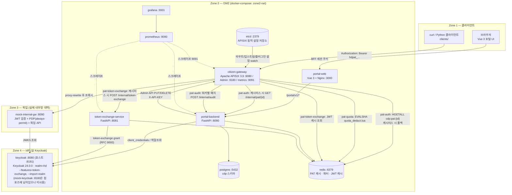
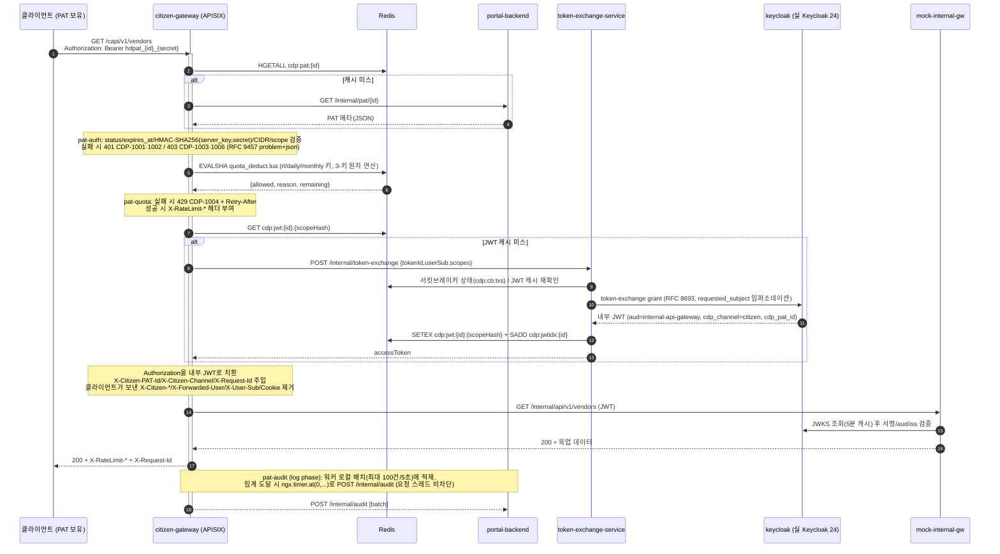
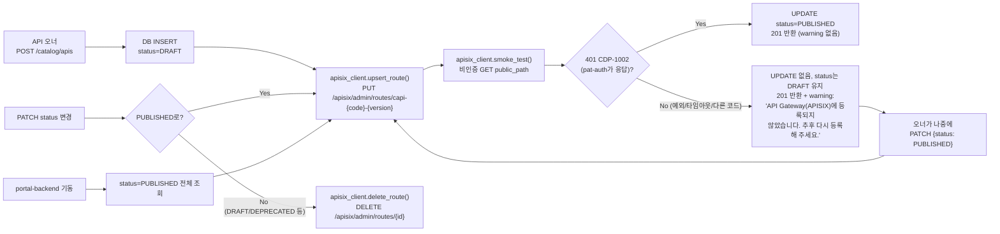

# Citizen Developer API Portal — 구현된 아키텍처

> 이 문서는 `01_시민개발자_API포털_아키텍처정의서.md` / `02_시민개발자_API포털_구현상세스펙.md`에서
> **실제로 이 리포지토리에 구현된 부분만**을 코드 기준으로 정리한 문서입니다. 스펙과의 차이(미구현/단순화된
> 부분)는 각 절 하단 "스펙과의 차이"에 명시합니다.
>
> Zone 4는 **2026-09-26부터 실 Keycloak(`quay.io/keycloak/keycloak:24.0.0`)로 전환**되었고, 기존
> `mock-keycloak` 서비스 블록은 롤백용으로 컴포즈에 그대로 남아 있지만 어떤 서비스도 참조하지 않습니다.
> Zone 3(내부 게이트웨이/PDP/MSA)는 여전히 목업(`mock-internal-gw`)입니다.

---

## 1. 전체 구성도



**스펙과의 차이**: 아키텍처정의서는 Zone 2 Gateway를 K8s 위 APISIX Pod x3 + etcd x3로 그리지만, 이 구현은
docker-compose 위 APISIX 단일 컨테이너 + etcd 단일 노드입니다(로컬 검증용 축소 구성). Redis도 단일 노드이며
스펙의 "Redis Sentinel 3노드"는 적용되지 않았습니다.

---

## 2. 시민 API 호출 경로 (Citizen Gateway 플러그인 체인)

`services/apisix-gateway/plugins/apisix/plugins/` 아래 커스텀 Lua 플러그인 4종이 `services/apisix-gateway/conf/config.yaml`에
등록되어 있고, 각 라우트(`services/portal-backend/apisix_client.py`가 생성)에 아래 순서·phase로 연결됩니다.

| 순서 | 플러그인 | phase | priority | 구현 스펙 절 |
| :-- | :-- | :-- | :-- | :-- |
| 1 | `pat-auth` | `rewrite` | 3010 | 6.2 — PAT 파싱/조회/상태·만료·HMAC·CIDR·Scope 검증 |
| 2 | `pat-quota` | `access` | 3005 | 6.3 — `infra/redis/quota_deduct.lua` EVALSHA 원자적 쿼터 차감 |
| 3 | `pat-token-exchange` | `access` | 3000 | 6.4 — JWT 캐시/TXS 호출/헤더 치환·스푸핑 헤더 제거 |
| 4 | `proxy-rewrite` (APISIX 내장) | `rewrite` | 1008 | `/capi/vN/...` → 업스트림 base path 재작성 |
| 5 | `pat-audit` | `log` | 100 | 6.5 — 워커별 배치, `ngx.timer.at`로 비동기 전송, PAT 평문 마스킹 |



**스펙과의 차이**
- Scope 매칭은 스펙 원문(`METHOD:PATH` 글롭 패턴)이 아니라 **라우트당 `{HTTP method: scope}` 맵**으로 단순화했습니다.
  라우트 자체가 이미 path를 고정하므로 기능적으로 동일합니다.
- 매칭되지 않는 `/capi/v1/*` 경로는 커스텀 `CDP-2002`가 아니라 APISIX 기본 404를 반환합니다.
- `pat-audit`은 스펙이 언급한 APISIX 내장 `batch-processor` 유틸 대신, 동일 동작을 하는 자체 구현(워커-로컬 테이블 +
  `ngx.timer.at`)을 사용합니다.

---

## 3. 카탈로그 등록 → 게이트웨이 자동 프로비저닝 파이프라인

`services/portal-backend/apisix_client.py` + `routers/catalog.py`가 스펙 8장 파이프라인을 구현합니다.
etcd는 빈 상태로 시작하므로, **portal-backend 기동 시 `status='PUBLISHED'`인 카탈로그 전체를 재동기화**합니다
(`main.py: resync_gateway_routes()`, 라우트별 재시도/백오프 — `citizen-gateway`가 이미 `portal-backend`에
`depends_on`이라 역방향 의존을 걸면 순환되기 때문).



라우트 빌드 규칙(`_build_route`, `route_id_for`):
- **라우트 id**: `capi-{api_code 소문자,특수문자→'-'}-{public_path에서 추출한 vN, 없으면 v1}`
- **uris**: `[public_path, public_path + "/*"]`
- **upstream**: `upstream_url`을 파싱해 `{scheme, netloc}` → `nodes`로 사용
- **proxy-rewrite**: `public_path`의 `/capi/vN` **접두어만** 업스트림 base path로 치환하고, 그 뒤(리소스명·서브패스)는
  그대로 전달 — 처음엔 `public_path` 전체를 치환하다가 리소스명이 통째로 사라지는 버그가 있었고, 실제 등록
  테스트로 발견 후 수정됨
- **required_scope_map**: `api_scope` 테이블의 `(http_method → scope_name)` 매핑

**스펙과의 차이**
- 스펙 8장은 실패 시 "라우트 삭제 + DRAFT 복귀"(하드 롤백, 사용자에게 에러 반환)를 명시하지만, 이 구현은
  **소프트 실패**로 바꿨습니다: 카탈로그 등록 자체는 `201`로 성공시키고 `DRAFT` + `warning` 메시지만 반환합니다
  (사용자 요청에 따른 변경). 이미 생성된 라우트를 지우지도 않습니다 — `upsert_route`가 성공했는데 smoke test만
  실패한 경우 라우트가 살아있을 수 있습니다.
- `openapi_spec` JSONB 컬럼은 DDL에 존재하지만 검증 로직(OpenAPI 스펙 필수 필드 체크)은 구현되지 않았습니다.
- 라우트 변경 스냅샷을 DB에 보관해 롤백하는 기능(스펙 8장 "멱등성" 절)은 없습니다 — Admin API PUT 자체가
  멱등적이라는 점만 활용합니다.

---

## 4. 서비스별 구성

| 서비스 | 기술 | 포트 | 역할 |
| :-- | :-- | :-- | :-- |
| `portal-web` | Vue 3.5 + Vite, Nginx | 3000 | 카탈로그/신청/PAT 발급/사용량 대시보드 SPA |
| `portal-backend` | FastAPI (Python) | 8080 | PAT 생애주기, 신청/승인, 카탈로그+게이트웨이 프로비저닝, 감사 적재, 배치 |
| `citizen-gateway` | Apache APISIX 3.9 + 커스텀 Lua 플러그인 | 9080 / 9180(admin) / 9091(metrics) | PAT 인증·쿼터·토큰교환·프록시·감사 |
| `etcd` | bitnamilegacy/etcd | 2379 | APISIX 동적 설정(라우트/업스트림) 저장소 |
| `token-exchange-service` | FastAPI | 8081 | RFC 8693 Token Exchange, JWT 캐시, 서킷브레이커 |
| `redis` | Redis 7 | 6379 | PAT 메타 캐시, 쿼터 카운터, JWT 캐시, negative cache, 서킷브레이커 상태 |
| `postgres` | Postgres 16 | 5432 | `cdp` 스키마 (카탈로그/신청/PAT/쿼터정책/감사로그/일별통계) |
| `keycloak` | Keycloak 24.0.0 (`quay.io/keycloak/keycloak`) | 8080 컨테이너 / 8181 호스트 | (Zone 4) OIDC 발급 + Token Exchange(RFC 8693). realm `hd` + 4명 사용자·HR/org 속성·역할·client `citizen-gw-exchanger`(impersonation 롤 부여) + audience client `internal-api-gateway`가 기동 시 `--import-realm`으로 로드됨 |
| `mock-keycloak` | FastAPI + RSA | 8180 | (롤백용, 미참조) 실 Keycloak 이전에 사용하던 목업 IdP. `docker-compose.yml`에 남아있지만 어떤 서비스도 `depends_on`에 포함하지 않음 |
| `mock-internal-gw` | FastAPI | 8090 | (Zone 3 목업) JWT 검증 + PDP(always-permit) + 목업 API 3종 |
| `prometheus` / `grafana` | — | 9090 / 3001 | 관측성 |

### portal-backend 라우터 (`/portal/v1` prefix, `internal`만 예외)

| 라우터 | 엔드포인트 | 비고 |
| :-- | :-- | :-- |
| `catalog` | `GET/POST /catalog/apis`, `GET/PATCH /catalog/apis/{id}` | §3 프로비저닝 파이프라인 포함 |
| `applications` | `POST/GET /applications`, `PATCH /applications/{id}` | 사용 신청/승인 |
| `tokens` | `POST/GET /tokens`, `DELETE /tokens/{id}`, `PUT /tokens/{id}/quota` | PAT 발급·폐기·쿼터 변경(즉시 Redis 반영) |
| `usage` | `GET /usage/tokens/{id}` | 일별 통계 + 실시간 Redis 쿼터 |
| `audit` | `GET /audit/logs` | 감사 로그 페이징 조회 |
| `admin_tokens` | `GET /admin/tokens`, `POST /admin/tokens/revoke` | (관리자) X일내 만료 PAT·발급자 조회, 사용자 ID 리스트 조회, 일괄 회수 (UC-10 / R-12) |
| `internal` | `GET /internal/pat/{id}`, `POST /internal/audit` | 게이트웨이 전용 (PAT 캐시 미스 폴백 / 감사 배치 수신). `X-Internal-Key` 필수 |
| `me` | `GET /me` | 내 프로필 |
| `dev_auth` | `GET /auth/dev-users`, `POST /auth/dev-login` | 로컬 개발용 로그인. `ENABLE_DEV_AUTH=true`일 때만 등록됨(기본 false) |

### 배치 작업 (`batch.py`, APScheduler + Redis 분산 락)

| 배치 ID | 주기 | 구현 상태 |
| :-- | :-- | :-- |
| `BAT-CDP-01` (감사로그 일별 집계) | 00:05 | ✅ 구현 |
| `BAT-CDP-03` (만료 PAT 처리) | 02:00 | ✅ 구현 |
| `BAT-CDP-04` (30일 미사용 PAT INACTIVE) | 02:30 | ✅ 구현 |
| `BAT-CDP-06` (감사로그 월 파티션 +2개월 선생성) | 매월 1일 01:00 | ✅ 구현 |
| `BAT-CDP-02/05/07` (만료 알림, 인사 연동, 재인증) | — | ❌ 미구현. 만료 알림은 관리자 조회 화면(`/cdp/admin/tokens`)으로 대체 |

### Postgres `cdp` 스키마

```mermaid
erDiagram
    api_catalog ||--o{ api_scope : "has"
    api_catalog ||--o{ application : "requested for"
    application ||--o{ pat : "issues"
    pat ||--o| quota_policy : "has"
    pat ||--o{ audit_log : "generates"

    api_catalog {
        uuid api_id PK
        varchar api_code UK
        varchar upstream_url
        varchar public_path UK
        varchar status "DRAFT/PUBLISHED/DEPRECATED/RETIRED"
    }
    api_scope {
        uuid scope_id PK
        uuid api_id FK
        varchar scope_name
        varchar http_method
        varchar path_pattern
    }
    application {
        uuid app_id PK
        uuid api_id FK
        varchar user_sub
        varchar status "PENDING/APPROVED/REJECTED/EXPIRED/WITHDRAWN"
        text_array granted_scopes
    }
    pat {
        varchar token_id PK
        uuid app_id FK
        varchar user_sub
        varchar token_hash "SHA256"
        varchar status "ACTIVE/REVOKED/EXPIRED/INACTIVE"
        text_array scopes
        text_array allowed_cidr
    }
    quota_policy {
        varchar token_id PK_FK
        int rate_limit_tps
        int burst
        int daily_quota
        int monthly_quota
    }
    audit_log {
        bigint id PK
        varchar event_type
        varchar token_id FK
        varchar trace_id
        int status_code
    }
    usage_stat_daily {
        varchar token_id
        date stat_date
        int call_count
    }
```

---

## 5. 보안 불변 규칙 (구현에서 지켜지는 것들)

1. **PAT 평문**은 발급 응답 1회 외 어디에도 저장되지 않음 — Redis에는 `HMAC-SHA256(secret, SERVER_KEY)`만 저장
   (`cdp:pat:{tokenId}` 해시의 `hash` 필드), DB에는 `SHA256(secret)` 해시만 저장(`pat_utils.hash_secret_sha256`,
   2026-09-21 Argon2id에서 변경 — 해시 대상이 사람이 고르는 저-엔트로피 패스워드가 아니라 256비트 CSPRNG
   값이라 느린 해시의 무차별 대입 방어 효과가 의미 없어 단순화. 여전히 단방향이라 DB 단독 유출로는 평문 복구
   불가능. AES256 같은 양방향 암호화로의 전환은 평문 복구가 가능해져 규칙 위반이 되므로 채택하지 않음).
2. **HMAC 상수시간 비교**: `pat-auth.lua`의 `common.constant_time_eq` (Python `hmac.compare_digest`에 대응하는
   수동 XOR-누적 구현, `resty.sha256` 기반 HMAC-SHA256과 함께 Python `hmac` 대비 값 일치 검증 완료).
3. **쿼터 원자성**: `infra/redis/quota_deduct.lua` 단일 Lua 스크립트로 토큰버킷(TPS/burst) + 일별/월별 쿼터를
   한 번의 `EVALSHA`로 처리(동시 20건 요청 시 정확히 10건만 통과하는 것으로 검증됨).
4. **PAT 폐기 즉시 반영**: `tokens.py`의 `DELETE`가 Redis 키를 즉시 삭제(`invalidate_pat`) → 다음 게이트웨이
   호출은 캐시 미스로 portal-backend에 재조회, PAT 상태가 `ACTIVE`가 아니므로 즉시 401.
5. **헤더 스푸핑 차단**: `pat-token-exchange.lua`가 클라이언트가 보낸 `X-Citizen-*`, `X-Forwarded-User`,
   `X-User-Sub`, `Cookie`를 전량 제거한 뒤 게이트웨이가 직접 계산한 값으로 재주입.
6. **감사로그 PAT 마스킹**: `pat-audit.lua`/`pat_utils.mask_pat`가 `hdpat_{12}_{43}` 패턴을 `hdpat_{12}_****`로
   치환 후 적재.
7. **오류 응답 포맷**: 게이트웨이·portal-backend 모두 RFC 9457 `application/problem+json` (`type/title/status/code/detail/instance`).
8. **내부 신뢰 경계**: portal-backend `/internal/*`와 TXS `/internal/token-exchange`는 `X-Internal-Key`
   공유 시크릿(상수시간 비교)을 요구합니다. 이게 없으면 네트워크 내 임의 컨테이너가 PAT 메타를 열람하거나,
   감사 로그를 위조하거나, PAT 검증을 건너뛰고 임의 사용자 사칭 JWT를 발급받을 수 있습니다. TXS는
   `allowed_cidr` IP 허용목록도 함께 검증합니다.
9. **최소 권한 (R-08)**: 신청 시 카탈로그에 정의되지 않은 Scope는 거부되고, 승인 시 부여 Scope는
   **서버가 신청 Scope ∩ 카탈로그 정의로 계산**합니다. 결재자는 승인/반려만 할 수 있고 Scope 문자열을
   수정하거나 확장할 수 없습니다.
10. **감사 로그 전수 기록**: `pat-audit`이 워커별 주기 타이머로 플러시하고 워커 종료 시에도 잔여분을
    전송합니다. 거부 이벤트(AUTH_FAILED/SCOPE_DENIED)에도 `token_id`·`trace_id`가 남아 오류율 집계와
    탈취 시도 추적이 가능합니다.

---

## 6. 로컬 실행

```bash
docker compose up -d postgres redis keycloak mock-internal-gw \
  etcd token-exchange-service portal-backend citizen-gateway portal-web
```

- `keycloak`은 `--import-realm`으로 `infra/keycloak/hd-realm.json`을 첫 기동 시 로드합니다. realm 정의를
  다시 반영하려면 `docker compose rm -sf keycloak && docker compose up -d keycloak`로 컨테이너를 재생성해야
  합니다(dev-mode의 H2 저장소가 컨테이너 라이프사이클에 매여 있어 restart만으로는 재임포트되지 않습니다).
- Keycloak 관리 콘솔: `http://localhost:8181/` (`admin`/`admin`, 로컬 전용). 컨테이너 내부에서 참조하는 issuer는
  `KC_HOSTNAME_URL=http://keycloak:8080`으로 고정되어 있어 발급된 JWT의 `iss` 클레임이
  `portal-backend`/`TXS`/`mock-internal-gw`의 `KC_URL` 값과 일치합니다.
- `etcd`는 빈 상태로 시작 → `portal-backend` 기동 시 `02_seed.sql`로 미리 심어둔 3개 PUBLISHED API
  (`MDM-VENDOR`/`FIN-ORDER`/`HR-EMPLOYEE`)를 자동으로 APISIX에 등록합니다.
- APISIX Admin API: `http://localhost:9180/apisix/admin/routes` (`X-API-KEY: edd1c9f034335f136f87ad84b625c8f1`, dev 전용 키).
- 통합/보안 테스트: `cd tests && pip install -r requirements.txt && pytest integration/ security/ -v`
  (전체 19건, docker-compose 기본 포트 그대로 사용 시 통과 — 단 컨테이너 UTC와 호스트 로컬 타임존이 자정
  경계를 사이에 두고 갈리는 순간에는 일별 쿼터 키 불일치로 3건이 일시적으로 실패할 수 있음, 로직 버그 아님).

### Zone 4 (Keycloak) 세부 구성

`infra/keycloak/hd-realm.json`에 정의된 realm 스냅샷:

| 항목 | 내용 |
| :-- | :-- |
| Realm | `hd` (`sslRequired=none`, `accessTokenLifespan=300`) |
| Client — `citizen-gw-exchanger` | confidential + service account. secret `exchanger-secret-xyz`. 서비스 계정에 realm-management `impersonation`·`view-users`·`query-users` 롤 부여(RFC 8693 `requested_subject` 임퍼소네이션 허용). 클라이언트 protocol mapper로 하드코딩 클레임(`cdp_channel=citizen`), 오디언스(`aud=internal-api-gateway`), HR/org 속성 8종(`user_id`,`company`,`org_cd`,`asgn_cd`,`dept_cd`,`job_tit_cd`,`offi_res_cd`,`user_origin`)을 access token에 자동 주입 |
| Client — `internal-api-gateway` | bearer-only. audience 매핑 상대. 실제 인증에는 쓰이지 않음 |
| Realm roles | `citizen-developer`, `mdm-reader`, `api-owner`, `platform-admin`, `service-account` |
| 사용자 4명 (id=sub) | `u-test-001`/hong.gildong (mdm-reader+citizen-developer), `u-test-002`/api.owner (api-owner+citizen-developer), `u-admin-001`/platform.admin (platform-admin+citizen-developer), `a453587`/lee.changyob (citizen-developer). 모두 비밀번호 `password`, HR/org 속성 세팅 |

**실 Keycloak 전환 시 코드 조정 사항 (2026-09-26)**

- `services/token-exchange-service/keycloak_client.py`: RFC 8693 exchange 요청에서 `audience` 파라미터를 제거.
  실 Keycloak은 `--features=token-exchange`가 켜져 있을 때 클라이언트-투-클라이언트 exchange의 audience에
  fine-grained authorization 정책을 강제하는데 dev realm은 그 정책을 설정하지 않았습니다. 대신
  `citizen-gw-exchanger`의 audience protocol mapper가 `aud=internal-api-gateway`를 그대로 주입합니다.
- `services/portal-backend/routers/dev_auth.py`: `client_credentials`로 서비스 계정 토큰을 먼저 발급받고 그것을
  `subject_token`으로 실은 뒤 `requested_subject`로 교환하는 2-스텝 흐름으로 변경. 목업 Keycloak은 client 인증만으로
  교환을 허용했지만 실 Keycloak은 `Client not allowed to exchange`로 거부합니다.
